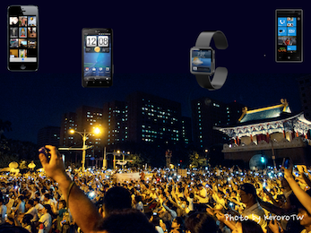

AllJoyn
-------

## The problem, or an example of an application of AllJoyn

Imagine we are at the "F*ck the government" demonstration in August.
At the moment where we light up our phones for a better judicial system for
Taiwan, being so touched and psychologically bonded with each other,
we want to share the photos and moments with people around us instantly to mark the moment.
What technology should we employ to achieve this?

Let us start with the requirements
* Cross platform
* Secure and decentralized, remember we want to f*ck the government.

Next, let us think about the high level implementation design.
First, we need to decide on the underlying communication technology. Options are:
* Relay servers, but we need to deal with the issue of room management, in this case based on proximity.
  As we scale, we willll also need to face the problem of inter-server communication.
  Obviously, servers are not a cost effective solution, an EC2 medium instance costs around $3,000NT a month.
  Last but not least, it is hard to distill trust in our tech savy potential users with a centralized server.
* Hybrid server appraoch, devices handle the discovery themselves,
  and use Interactive Connectivity Establishment (ICE) servers as pipes.
* Bluetooth, designed only for short range, 5~7 size device groups.
* Airdrop, hard to modify for broadcast like needs, does not work for non-Apple devices.
  The same goes for Windows plug and play.
* Wifi, Wifi-direct, 802.11s mesh and friends have great technological prospects.
  802.11s mesh was rectified in 2012, after a remarkably speedy ten years or so of work.

Second, we need to decide on
* The threading model, since the blocking time of network IO cannot be neglected in general,
  and we in effect need all devices to be both a client and a server.
* The marshalling format of our remote procedural calls.
  More generally, how to describe an object and it is methods across devices.
  Inspirations can be found in the four primary component types of Android, and COM in windows.
* How we react to dynamic, ad-hoc network changes, and how to ensure security.

## AllJoyn's answer to the above requirements and problems
For the underlying communication, AllJoyn re-implements the wire protocol set forth by the D-Bus specification,
the interprocess communication system used by Qt and GNOME, and extends the D-Bus wire protocol to
support distributed devices. For a graphical explanation about the AllJoyn bus,
please see https://www.alljoyn.org/docs-and-downloads/documentation/introduction-alljoyn

On the API side, AllJoyn espouses an object oriented design, with extensions to support an distributed environment.
As an example, say we conceive of an interface, or a set of methods that is needed to support our application.
Of course, this interface needs a name, lets name it "com.cardinalblue.bulu".
In general, there may be multiple objects providing different implementations of this same interface,
residing in different locations, say "/buluService", "/buluService/richContent", etc.
In a distributed environment, we need a way to differentiate between the same objects residing in different devices.
In other words, objects on each device need to have a globally unique well-known name say
"com.cardinalblue.bulu.bob" and "com.cardinalblue.bulu.alice". Once a well-known name has been taken by some object,
later requests to obtain name should be rejected by the system.
In summary, while implementing an AllJoyn service, we will need to come up with these three strings:
* Interface name
* Object path
* Well-known name. Unlike the other two, this is likely to generated at runtime.

## Limitations
* Bluetooth does not work on iOS yet. On Android, Bluetooth works only rooted devices.
  Moreover, since AllJoyn utilitizes the BlueZ stack by Qualcomm, it is uncertain what
  happens now since Android switched to the Bluedroid stack by Broadcom in Nov 2012.
* For discovery and broadcast to work, port 9956 must be opened on the Wifi router.
* Wifi broadcast has the peculiar property that the last packets a devices missed when it was offline
  is sent sometimes duplicatively to it when it comes online.

## Elaborations
Going down the ledder of abstraction, Qualcomm introduced AllJoyn thin client which is a stripped down version
especially for embedded hardware such as Light switches, fridges, toasters etc. The main difference lies
in the fact that AllJoyn thin client does not include a daemon, and relies on other more powerful devices
such as a smartphone to perform this function. A typical AJTC run in as little as 25 Kbytes of memory,
whereas a bundled-daemon and C++ client or service combination may require ten times that amount,
and a Java language version may require as much as 40 times that footprint.

Going up the ledder of abstraction, AllJoyn has frameworks for Android that performs full fledged functionalities
such as Audio streaming and control panels for embedded hardware.

